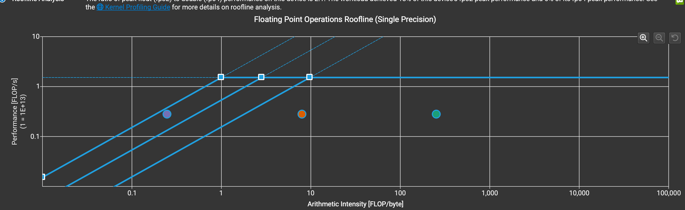
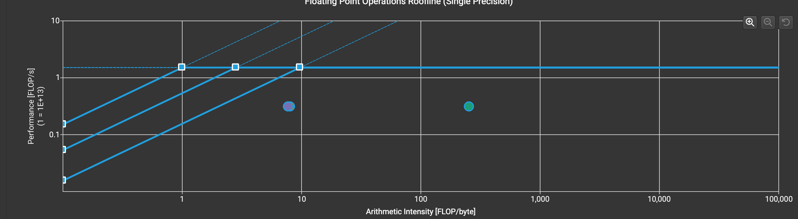
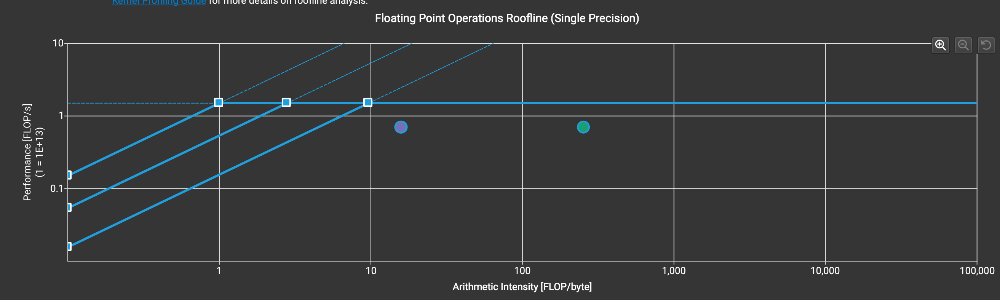

# CUDA_GEMM_OPTIMIZATION

## Introduction

This project explores CUDA optimization for single-precision general matrix multiplication (GEMM), computing **C = A × B**. It starts with a direct implementation and progressively adds shared-memory tiling and register tiling to increase data reuse and floating-point throughput.

NVIDIA Nsight Compute profiles and roofline analysis are used to connect each code change with its effect on memory traffic, occupancy, pipeline utilization, and execution time. Kernel results are checked against cuBLAS with a floating-point tolerance. Unless stated otherwise, the measurements below use **M = N = K = 1024** on an **NVIDIA A100-SXM4-40GB**. Throughput is calculated as `2MNK / kernel_time`.

## Goal

- Build a correct FP32 GEMM baseline and improve it through measurable, incremental changes.
- Reduce redundant global- and shared-memory traffic with coalesced access, block tiling, and register reuse.
- Study how tile size, register pressure, shared-memory use, and occupancy affect performance.
- Use Nsight Compute metrics and roofline plots to identify the limiting resource at each stage.
- Validate every kernel against cuBLAS and document the precision mode used for comparison.
- Investigate tile and wave quantization before exploring Tensor Core acceleration.

## Optimization Journey

### Naive Implementation

> **Approach**
>
> - Compute each output element as a dot product, reading operands directly from global memory.
> - Establish a baseline for correctness and performance comparisons.
>
> **Limitations**
>
> - Neighboring threads repeatedly request overlapping input data; reuse depends on the cache hierarchy.
> - Each thread accumulates one output, limiting explicit operand reuse across output elements.
>
> **Nsight Compute Observation**
>
> - Kernel time: **781.888 µs**; achieved throughput: **2.747 TFLOP/s**.
> - Achieved occupancy is **94.8%**, while FMA-pipeline utilization is only **21.5% of peak sustained throughput during active cycles**. High occupancy therefore does not compensate for repeated operand loads and limited per-thread reuse.
>
> **FP32 Roofline**
>
> 

### Shared-Memory Tiling

> **Optimizations**
>
> - Cooperatively load A and B tiles into shared memory, allowing threads in a block to reuse the staged operands.
> - Reduce global-load requests compared with the naive implementation.
> - Achieve 100% global load/store sector utilization in the recorded profile through coalesced accesses.
>
> **Remaining Limitations**
>
> - Each thread still computes one output, requiring shared-memory operand loads for every multiply-add.
> - Shared-memory access and instruction throughput remain potential limits after reducing global-memory traffic.
> - Broadcasts can lower the reported bytes per shared-memory wavefront without causing bank conflicts; this metric alone does not establish a bottleneck.
>
> **Nsight Compute Observation**
>
> - Kernel time: **703.264 µs**; achieved throughput: **3.054 TFLOP/s**, or **1.11×** the naive kernel.
> - Achieved occupancy remains **94.8%**, but FMA-pipeline utilization is **20.9% of peak sustained active throughput**. Staging operands in shared memory reduces global-memory work, while the one-output-per-thread design still limits operand reuse and compute throughput.
>
> **FP32 Roofline**
>
> 

### Register Tiling

> **Optimizations**
>
> - Assign each thread a small output tile and retain its partial sums in registers.
> - Reuse each loaded A operand across multiple output columns and each B operand across multiple output rows, reducing shared-memory loads per FLOP.
> - Use warp and lane IDs to map output tiles to threads, together with shared-memory padding to reduce bank conflicts in operand reads.
> - Use aligned `float4` stores for four consecutive output columns, achieving 100% global load/store sector utilization in the recorded profile.
>
> **Observed Performance**
>
> - Kernel time: **368.448 µs**; achieved throughput: **5.828 TFLOP/s**.
> - This is **1.91×** the shared-memory kernel and **2.12×** the naive kernel in the saved Nsight Compute reports.
> - Achieved occupancy falls to **25.0%**, while FMA-pipeline utilization rises to **42.6% of peak sustained active throughput**. The higher throughput shows that register reuse and more work per thread outweigh the lower number of resident warps for this configuration.
>
> **Remaining Tradeoffs**
>
> - Larger per-thread tiles improve operand reuse but increase register pressure and can reduce occupancy or cause spilling.
> - Further tuning requires examining shared-memory throughput, instruction issue efficiency, dependency stalls, and register spills alongside the roofline result.
> - Performance varies with matrix dimensions and tile parameters, so each configuration must be profiled and validated independently.
>
> **FP32 Roofline**
>
> 

### Tensor Core Acceleration

Planned: explore Tensor Core GEMM and compare its throughput and numerical accuracy with the FP32 implementations, documenting the input and accumulation precision used.

## Tile Quantization on Register-Tiling

## Wave Quantization on Register-Tiling

## Results

## Conclusion
